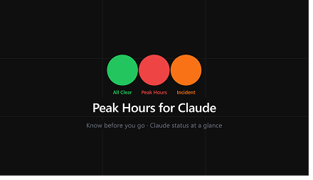
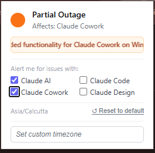
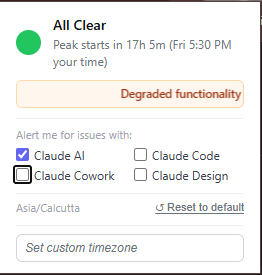
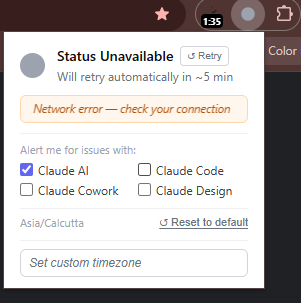

# Peak Hours for Claude

A Chrome extension that shows a colored dot in your toolbar so you always know whether Claude is slow, down, or good to go — without opening a status page.

---

## What the colors mean

🟢 **Green** — Off-peak, no incidents. Good time to use Claude.  
🔴 **Red** — Peak hours. Claude may be slower than usual.  
🟠 **Orange** — Active incident on a product you're watching.  
⚫ **Grey** — Couldn't reach the status page. Will retry in 5 min.

---

## Screenshots


<table>
<tr>
<td align="center"><br><sub>Orange — partial outage on a watched product</sub></td>
<td align="center"><br><sub>Green — incident exists but not on your watched products</sub></td>
<td align="center"><br><sub>Grey — network error, retry available</sub></td>
</tr>
</table>

---

## How it works

- Checks [status.claude.com](https://status.claude.com) every 5 minutes
- Peak hours (weekdays, 5–11 AM Pacific) turn the dot red
- An active incident on a product you're watching turns it orange
- You pick which Claude products matter to you — AI, Code, Cowork, or Design; at least one must stay selected at all times
- Your timezone is auto-detected and used for the time displays; change it anytime from the popup

---

## Folder structure

```
extension/
├── manifest.json
├── background/
│   └── service-worker.js
├── popup/
│   ├── popup.html
│   ├── popup.js
│   └── popup.css
├── data/
│   └── timezones.json
├── icons/
│   ├── logo_16.png
│   ├── logo_48.png
│   └── logo_128.png
└── images/
    ├── screenshots/
    └── promo_tile/
```

---

## Credits

Inspired by [PeakClaude](https://github.com/pforret/PeakClaude) by [@pforret](https://github.com/pforret) — the original resource for tracking Claude's peak hours.
